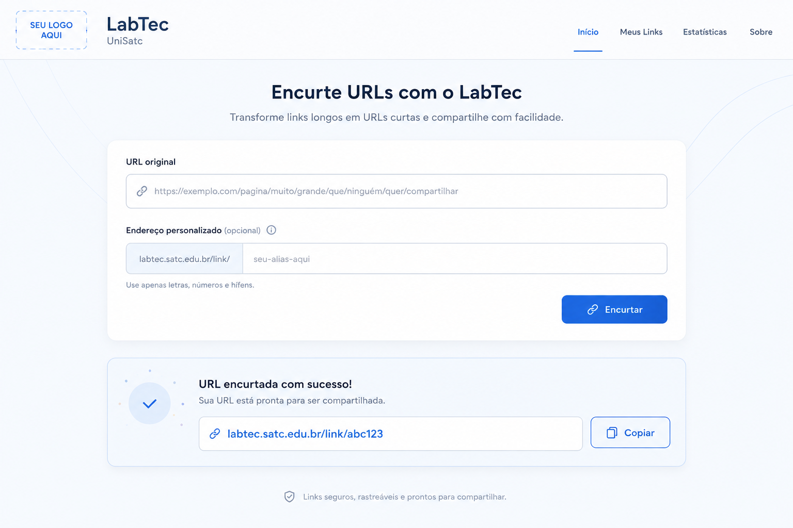

# Desafio LabTec: Encurtador de URL

## Visão geral



O objetivo deste desafio é construir uma aplicação de encurtamento de URLs com backend e frontend independentes. O repositório funciona como ponto de partida para uma entrega progressiva: primeiro o MVP, depois requisitos adicionais em camadas.

O projeto representa uma aplicação funcional que pode evoluir para um serviço interno do LabTec, com links como:

```text
https://labtec.satc.edu.br/link/{slug}
```

## Entrega Mínima

O MVP esperado é uma aplicação que permita criar encurtamento de URLs e acessar os links encurtados.

Você deve implementar a solução escolhendo a própria arquitetura, tecnologias e estratégia de construção, desde que o sistema atenda aos requisitos mínimos especificados abaixo.

Ao final, a documentação da solução também deve explicar quais requisitos foram atendidos e como eles foram implementados.

### Requisitos Mínimos

1. **Criação de Links Curtos**: deverá ser possível cadastrar uma URL para receber um link curto compartilhável.
2. **Acesso ao Link Original**: ao acessar o link curto, o usuário deve ser redirecionado para a URL original. Quando o link não existir, a aplicação deve informar isso de forma adequada. Todos os redirecionamentos devem ser feitos pelo frontend. O backend será responsável apenas por fornecer a URL original ou informar que o link não existe.
3. **Endereço Personalizável**: o usuário deve poder escolher o identificador curto (slug) para o link encurtado, caso deseje. Se o usuário não escolher, a aplicação deve gerar um identificador curto automaticamente. Se o identificador escolhido já estiver em uso, a aplicação deve informar que não é possível utilizá-lo.
4. **Quantidade de Acessos**: O sistema deve permitir consultar a quantidade de vezes que um link curto foi acessado e incrementar esse total a cada acesso.
5. **Dados adicionais**: O sistema deve armazenar data de criação, endereço IP do usuário que criou o link e data do último acesso. Essa informação deve estar disponível para consulta no backend, mas não precisa ser exibida no frontend.
6. **Persistência de Dados**: Os dados dos links encurtados devem ser armazenados de forma persistente, mesmo após reinicialização da aplicação. Pode-se utilizar banco de dados local, arquivos ou qualquer outra forma de armazenamento que não dependa de serviços externos.
7. **Infraestrutura**: Deve ser possível rodar a aplicação localmente, sem necessidade de serviços externos. O uso de banco de dados local é permitido desde que seja possível subir a aplicação com um único comando.

Além disso, deve-se entregar junto com a solução uma documentação que explique como os requisitos foram atendidos, incluindo instruções de instalação e execução da aplicação.

## Como trabalhar com o repositório

1. Faça um fork deste repositório.
2. Clone o fork para sua máquina.
3. Crie uma branch para a sua implementação.
4. Desenvolva a solução em etapas, seguindo os requisitos que quiser entregar primeiro.
5. Abra um Pull Request quando quiser submeter para análise ou code review.

## Estrutura da documentação

- [assets/](assets/) - imagens e outros arquivos de apoio.
- [docs/EXTENSIONS.md](docs/EXTENSIONS.md) - requisitos adicionais e diferenciais.

## Princípios do desafio

- Backend e frontend devem ser independentes.
- Toda regra de negócio relevante deve estar disponível pela API.
- O desafio deve poder ser entregue em camadas, do MVP até extensões opcionais.
- Liberdade de decidir como construir a solução e depois registrar na própria documentação como os requisitos foram atendidos.

## Dúvidas

Se houver dúvidas sobre o desafio, abra uma **issue** neste repositório.

Boa implementação!
